<div align="center">

# 💠 The Shelf
### The Agentic Curator that Optimizes for Growth, Not Attention.

[](https://reactjs.org/)
[](https://vitejs.dev/)
[](https://clerk.com/)
[](https://expressjs.com/)
[](https://sqlite.org/)
[](https://groq.com/)

<p align="center">
  <strong>The Shelf is not a feed. It is a mirror and an anvil.</strong><br>
  Built with a premium SaaS design system, powered by ultra-fast Groq LLM inference and Clerk authentication.
</p>

</div>

---

## ✦ The Vision
Most algorithms are designed to hijack your attention. **The Shelf** is an autonomous agentic curator designed to elevate your human potential. It models your aspirations, habits, and evolving identity to deliver highly specific media, challenges, and interventions tailored to bridge the gap between who you are and who you want to become.

- **No infinite scrolling.** The daily shelf is capped at **3 items max**.
- **Human-readable Identity Ledger.** Your model isn't a black-box embedding; it's a transparent, auditable ledger of your explicit aspirations and proven competencies.
- **Proof of Action Verification.** Upload GitHub PRs, code snippets, or reflections to prove execution to the AI agents.
- **Zero-Item Day Anti-Dopamine Enforcement.** The AI agent will actively lock the platform when your focus is already optimal.
- **Portable Identity Passport.** One-click export of your verified identity as `identity_passport.json` for external LLMs.

---

## ✦ Feature Highlights

### 🧠 The Identity Ledger
An auditable, living ledger of who you are trying to become. When you finish a book, ship a project, or stall on a challenge, the AI agents update this ledger. You have full transparency and editing rights to ensure the model aligns with your true self.

### 🪞 The Attention Twin & Counterfactual Projections
A continuous visual divergence chart comparing your **Potential Index** (what you've built, learned, and earned) against your **Attention Potential** (where default engagement algorithms drag you), complete with 60-day counterfactual trajectory projections.

### 🛡️ Audacious Zero-Item Day Mode
Showcases the AI making the ultimate call: withholding content entirely. When the AI agent determines your cognitive load and focus are already optimal, it locks the shelf with an anti-dopamine visual shield.

### 🤖 Multi-Agent Engine (Groq Llama 3.3 70B)
1. **Master Orchestrator Agent:** Supreme supervisor synthesizing outputs from all sub-agents into a unified Master Alignment Score (0-100), executive trajectory verdict, and strategic directive.
2. **Onboarding Agent:** Translates structured interview (voice or text) into verifiable identity claims.
3. **Daily Curator Agent:** Evaluates 7 distinct interventions (deliver, challenge, mentor intro, counterpoint, revisit, rest, withhold) and logs rejected alternatives.
4. **Weekly Review Agent:** Wakes up every 7 days to analyze habit patterns, highlight hypocrisies, and propose ledger diffs.

---

## ✦ Architecture & Tech Stack

```mermaid
graph TB
    subgraph Client_Layer["🖥️ Client Layer (React 18 + Vite 8)"]
        Landing["Landing Page / Hero"]
        AuthUI["Clerk OAuth Split-Screen"]
        Dashboard["SaaS Dashboard Shell"]
        
        subgraph Dashboard_Screens["Dashboard Views"]
            MasterView["Master Agent Command Center & Alignment Score"]
            ShelfView["Today's Shelf + Proof Modal"]
            TwinView["Attention Twin & 60-Day Counterfactual"]
            LedgerView["Identity Ledger & Time-Travel"]
            FutureView["Future Self Portrait & Markers"]
            ReviewView["Weekly Review Proposal Matrix"]
            ProfileView["Profile & Passport (.json) Export"]
            VoiceInput["Voice-Guided Onboarding (Web Speech API)"]
        end
      
        Dashboard --> Dashboard_Screens
    end

    subgraph Auth_Security["🔒 Auth & Security Layer"]
        ClerkSDK["@clerk/react SDK"]
        JWTGuard["Clerk JWT Authentication Guard"]
        ClerkSDK --> JWTGuard
    end

    subgraph API_Layer["🚀 Express.js API Layer (Port 3001)"]
        ClockRouter["/api/clock (Simulation Time)"]
        MasterRouter["/api/master (Master Orchestrator Synthesis)"]
        ShelfRouter["/api/shelf (Growth vs Attention)"]
        TwinRouter["/api/twin (Divergence & Metrics)"]
        LedgerRouter["/api/ledger (Event Sourcing)"]
        ProofRouter["/api/proof (Action Verification)"]
        PassportRouter["/api/passport (.json Export)"]
        ReviewRouter["/api/review (Weekly Diff Matrix)"]
    end

    subgraph Engine_Layer["⚙️ Core Algorithmic Engines"]
        GrowthRanker["Growth Ranking Engine"]
        AttentionRanker["Attention Decay Calculator"]
        PotentialIndex["Potential Index Calculator"]
        HabitDetector["Habit Pattern Detection Engine"]
        StageEval["Cognitive Stage Evaluator"]
    end

    subgraph Agent_Layer["🤖 Autonomous Groq Multi-Agent Ecosystem"]
        MasterAgent["Master Orchestrator Agent\n(Supreme Synthesis & Alignment Score)"]
        OnboardAgent["Onboarding Agent\n(Interview -> Identity Claims)"]
        DailyAgent["Daily Curator Agent\n(7 Interventions & Rationale)"]
        ReviewAgent["Weekly Review Agent\n(Contradiction & Diff Engine)"]
        
        MasterAgent --> OnboardAgent
        MasterAgent --> DailyAgent
        MasterAgent --> ReviewAgent
    end

    subgraph LLM_Infra["⚡ AI Infrastructure"]
        GroqSDK["Groq SDK (llama-3.3-70b-versatile)"]
        JSONParser["Structured JSON Parser & Fallback"]
        GroqSDK <--> JSONParser
    end

    subgraph Database_Layer["📦 Database & Persistence Layer (SQLite WAL Mode)"]
        DB_Ledger["ledger_rows (Claims & Strengths)"]
        DB_Events["ledger_events (Append-Only Time Travel Audit)"]
        DB_Future["future_self (Portrait & Markers)"]
        DB_Proofs["proofs & artifacts (Verified Evidence)"]
        DB_Actions["agent_actions (Rationale & Alternatives)"]
        DB_Deliveries["deliveries & regret_responses (Ranker Logs)"]
    end

    %% Connections
    AuthUI <--> ClerkSDK
    Dashboard_Screens <--> API_Layer
    JWTGuard --> API_Layer

    API_Layer <--> Engine_Layer
    API_Layer <--> Agent_Layer
    Engine_Layer <--> Database_Layer

    Agent_Layer <--> LLM_Infra
    Agent_Layer <--> Database_Layer
```



---

## ✦ Detailed Tech Stack Specifications

| Layer | Technologies & Tools |
| :--- | :--- |
| **Frontend** | React 18, Vite 8, Framer Motion, Recharts, Lucide Icons, Web Speech API |
| **Authentication** | Clerk Auth (`@clerk/react`), OAuth 2.0 Providers, JWT Middleware |
| **Backend Framework** | Node.js 22, Express 4.x, CORS, Helmet Security Headers |
| **AI / LLM Engine** | Groq SDK (`llama-3.3-70b-versatile`), Structured JSON Outputs |
| **Database** | SQLite3 (`node:sqlite`), WAL Mode, Append-Only Event Sourcing |
| **Export Format** | Portable Identity Passport (`identity_passport.json`) |
| **Deployment** | Docker multi-stage container, Render (Backend), Vercel (Frontend) |

---

## ✦ Getting Started

### Prerequisites
- Node.js v18+
- A valid Groq API Key (`GROQ_API_KEY`)
- Clerk Publishable Key (`VITE_CLERK_PUBLISHABLE_KEY`)

### Installation & Local Setup

1. **Clone the repository**
   ```bash
   git clone https://github.com/Mayank-iitj/TheShelf.git
   cd TheShelf
   ```

2. **Install Dependencies**
   ```bash
   # Install backend dependencies
   cd server && npm install
   
   # Install frontend dependencies
   cd ../client && npm install
   ```

3. **Configure Environment**
   ```bash
   cd ../
   # Configure client/.env and server/.env
   ```
   - In `client/.env`: Set `VITE_CLERK_PUBLISHABLE_KEY=pk_test_...`
   - In `server/.env`: Set `GROQ_API_KEY=gsk_...` and `CLERK_SECRET_KEY=sk_test_...`

4. **Run the Application**
   ```bash
   # Starts Express server (port 3001) and Vite dev server (port 5173) concurrently
   npm run dev
   ```

---

## ✦ Production Deployment

The project is configured for deployment on Vercel (Frontend) and Render/Railway (Backend API).

```bash
docker build -t theshelf-app .
docker run -p 3001:3001 -e GROQ_API_KEY=your_key_here theshelf-app
```

---

<div align="center">
  <i>"You are what you repeatedly do. Excellence, then, is not an act, but a habit."</i>
</div>
