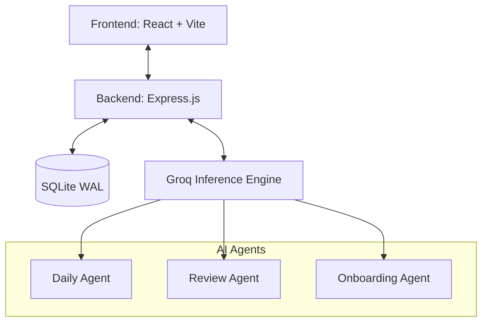

<div align="center">

# ⚡ TheShelf
### The Agentic Curator that Optimizes for Growth, Not Attention.

[](https://reactjs.org/)
[](https://vitejs.dev/)
[](https://expressjs.com/)
[](https://sqlite.org/)
[](https://groq.com/)

<p align="center">
  <strong>The Shelf is not a feed. It is a mirror and an anvil.</strong><br>
  Built with a premium cinematic design system, powered by ultra-fast LLM inference.
</p>

</div>

---

## ✦ The Vision
Most algorithms are designed to hijack your attention. **TheSmith** is an agentic curator designed to elevate your potential. It models your aspirations, habits, and evolving identity to deliver highly specific media, challenges, and interventions tailored to bridge the gap between who you are and who you want to become.

- **No infinite scrolling.** The daily shelf is capped at 3 items.
- **Human-readable Identity Ledger.** Your model isn't a hidden black-box embedding; it's a transparent ledger of your explicit aspirations and proven competencies.
- **Regret-optimized.** Built around long-term fulfillment rather than short-term dopamine spikes.

---

## ✦ Features

### 🧠 The Identity Ledger
An auditable, living ledger of who you are trying to become. When you finish a book, ship a project, or stall on a challenge, the AI agents update this ledger. You have full transparency and editing rights to ensure the model aligns with your true self.

### 🪞 The Attention Twin
A continuous visual divergence chart comparing your "Potential Index" (what you've built, learned, and earned) against your "Attention Potential" (where the algorithm would have dragged you). 

### 🤖 Multi-Agent Ecosystem
TheSmith relies on a suite of Groq-powered AI agents (using Llama 3 70B):
1. **Onboarding Agent:** Translates your initial interview into structured goals.
2. **Daily Curator:** Selects from 7 distinct interventions (deliver, challenge, mentor intro, counterpoint, revisit, rest, withhold). It knows when to leave you alone.
3. **Weekly Review Agent:** Wakes up every 7 days to analyze your actions, point out hypocrisies in your ledger, and propose course corrections.

---

## ✦ Architecture & Tech Stack



- **Frontend:** React, Vite, Recharts, Cinematic Dark Mode (Verity Framer template inspired)
- **Backend:** Express.js, `better-sqlite3` (WAL Mode for high concurrency)
- **AI Infrastructure:** Groq SDK (Llama-3-70b-8192)
- **Deployment:** Multi-stage Dockerfile, production ready

---

## ✦ Getting Started

### Prerequisites
- Node.js v18+
- A valid Groq API Key (`GROQ_API_KEY`)

### Installation

1. **Clone the repository**
   ```bash
   git clone https://github.com/your-username/thesmith.git
   cd thesmith
   ```

2. **Install Dependencies**
   ```bash
   # Install backend dependencies (uses --ignore-scripts for better-sqlite3 compatibility on Windows)
   cd server && npm install --ignore-scripts
   
   # Install frontend dependencies
   cd ../client && npm install
   ```

3. **Configure Environment**
   ```bash
   cd ../
   cp .env.example .env
   ```
   *Open `.env` and insert your `GROQ_API_KEY`.*

4. **Run the Application**
   ```bash
   # Starts both the Express server (port 3001) and Vite dev server (port 5173)
   npm run dev
   ```

---

## ✦ Production Deployment
The application is pre-configured with a multi-stage Dockerfile for easy, secure deployment to platforms like Render, Railway, or Fly.io.

```bash
docker build -t thesmith-app .
docker run -p 3001:3001 -e GROQ_API_KEY=your_key_here thesmith-app
```

---

<div align="center">
  <i>"You are what you repeatedly do. Excellence, then, is not an act, but a habit."</i>
</div>
